# Cylinder Impact Replication

Python replication of the numerical experiments in *Impact of an Infinite Cylinder*, focused on the Dirichlet-to-Neumann (DtN) operator for a free surface and the linearized time-dependent impact simulation driven by a Gaussian pressure field.

The repository contains:

- a Python implementation of the DtN matrix construction
- an FFT-based spectral DtN reference for validation
- a Crank-Nicholson free-surface simulation that mirrors the MATLAB appendix code
- the original MATLAB scripts used as the reference source
- generated figures in `results/figures` for quick visual comparison

## What This Project Reproduces

The underlying model treats the fluid as inviscid, incompressible, and irrotational in the lower half-plane. The main numerical ingredients are:

- a dense DtN matrix that maps surface potential `phi(x, 0)` to the normal derivative `phi_z(x, 0)`
- a spectral DtN operator used as a high-accuracy benchmark
- a block Crank-Nicholson time integrator for the coupled free-surface variables `eta` and `phi`
- a Gaussian pressure loading of the form
  `p_s(x, t) = exp(-x^2) * (0.5 - 0.5 cos(2 pi t))`

The Python implementation is written to closely follow the reconstructed MATLAB appendix listings in [`original/`](./original).

## Repository Layout

```text
cylinderimpact_replication/
|-- src/
|   |-- dtn.py            # DtN matrix construction and spectral reference helper
|   |-- spectral.py       # FFT-based DtN operator
|   `-- simulation.py     # Time-dependent free-surface simulation
|-- experiments/
|   |-- gaussian_test.py      # DtN vs spectral validation on a Gaussian
|   `-- convergence_test.py   # Refinement and exact sinusoidal tests
|-- original/
|   |-- DtNmatrix.m
|   `-- simulation.m
|-- results/
|   `-- figures/          # Saved MATLAB/Python output figures
|-- requirements.txt
`-- README.md
```

## Installation

Create a virtual environment if you want an isolated setup, then install the requirements:

```bash
pip install -r requirements.txt
```

Dependencies:

- `numpy`
- `matplotlib`
- `scipy`
- `jupyter`

## How To Run

Run commands from the repository root.

### 1. Validate the DtN matrix against the spectral method

```bash
python experiments/gaussian_test.py
```

This script:

- applies the DtN matrix to a Gaussian test function
- compares the result with the FFT-based spectral operator
- saves validation figures into `results/figures`

### 2. Run the convergence study

```bash
python experiments/convergence_test.py
```

This script:

- measures Gaussian-test error over multiple grid sizes
- checks a sinusoidal case with a known exact DtN response
- reports structural diagnostics such as symmetry and row-sum behavior

### 3. Run the free-surface simulation

```bash
python -m src.simulation
```

This script:

- constructs the DtN matrix and second-difference operator
- advances the coupled system with Crank-Nicholson time stepping
- saves the Gaussian pressure surface and several free-surface snapshots

## Results

### 1. DtN validation on a Gaussian input

The first question in the replication was whether the Python DtN matrix reproduces the same operator behavior as the original MATLAB construction. For this, both codes apply the DtN operator to the smooth test function

\[
\phi(x) = e^{-x^2},
\]

and compare the matrix result against the FFT-based spectral reference.

MATLAB reference:

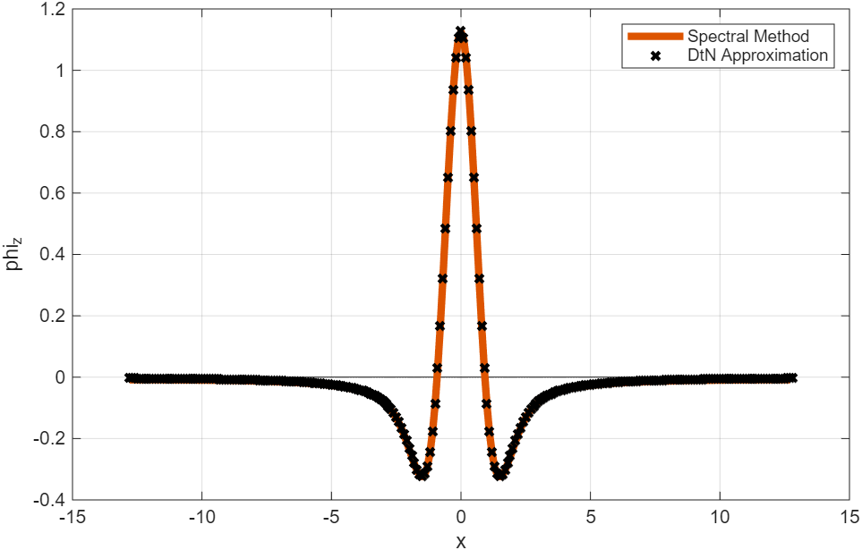

Python replication:

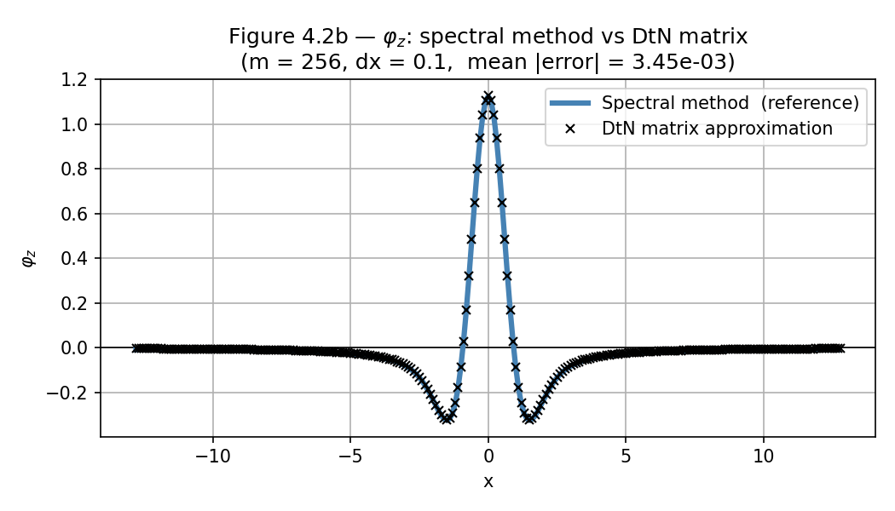

This is the most important validation in the repository. The close agreement shows that the replicated DtN matrix is capturing the same surface-normal derivative as the original construction.

For completeness, the Gaussian input itself is also saved:

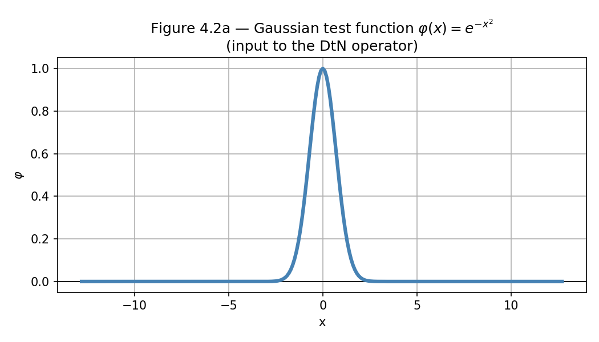

### 2. DtN matrix structure

The DtN operator is assembled as a dense symmetric Toeplitz-like matrix: each row is essentially a shifted copy of a common weight pattern. This is a useful structural check because it reflects the translation-invariant way the operator is built from the underlying integral formula.

MATLAB structure plot:

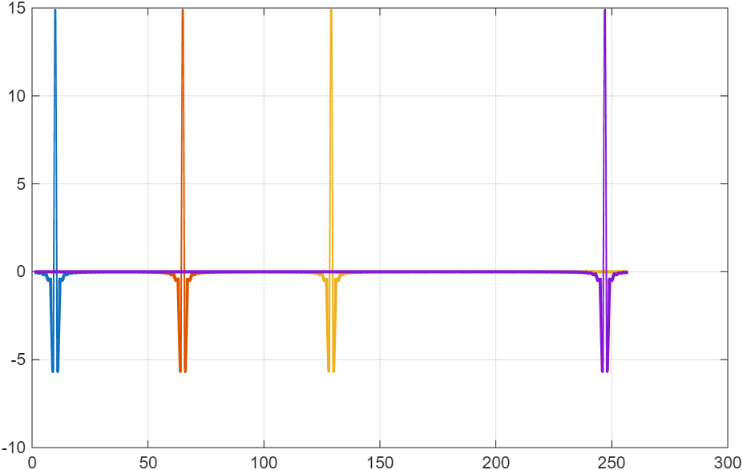

Python row-structure plot:

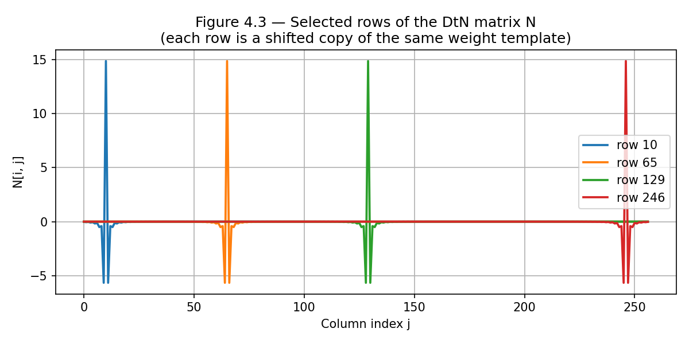

These plots are not just cosmetic. They help confirm that the Python code is assembling the same kind of operator as the MATLAB original, not merely producing similar output for one test case.

### 3. Convergence and exact validation

Beyond reproducing the paper-style Gaussian comparison, the Python experiments also include two stronger checks:

- a Gaussian refinement study, which tracks how the DtN error decreases as the grid is refined,
- a sinusoidal exact test, where the DtN action is known analytically for a pure Fourier mode.

Gaussian convergence:

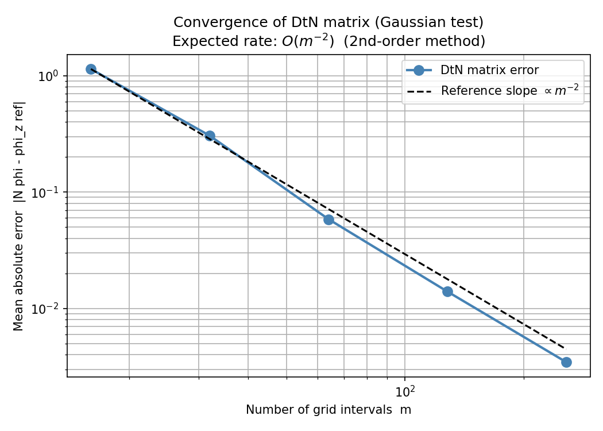

Sinusoidal exact test:

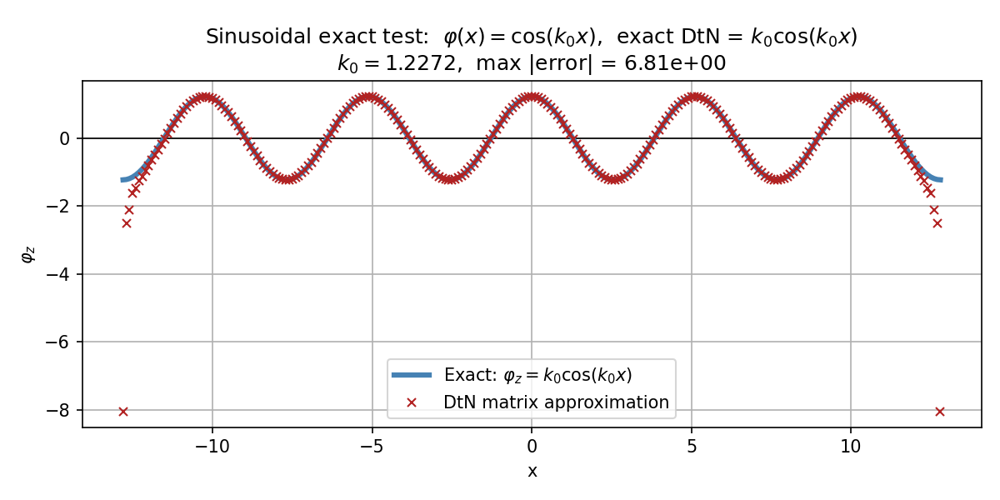

These figures go a bit beyond the original appendix-style scripts and make the replication more convincing numerically. They show that the Python implementation is not only qualitatively similar, but also behaves like a consistent convergent discretization.

### 4. Pressure forcing used in the simulation

The time-dependent simulation is driven by a localized Gaussian pressure field with compact temporal variation,

\[
p_s(x, t) = e^{-x^2}\left(\frac12 - \frac12\cos(2\pi t)\right).
\]

MATLAB pressure surface:

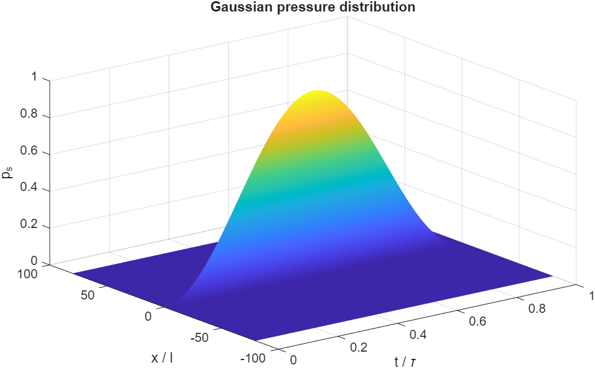

Python pressure surface:

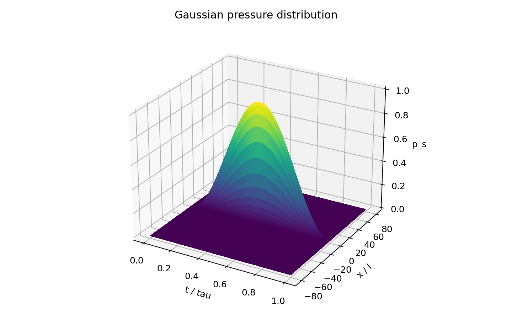

The two renderings do not look perfectly identical because MATLAB and Matplotlib handle 3D surface rendering differently, but they represent the same forcing law and the same parameter choices.

### 5. Free-surface response

The final replication target is the coupled free-surface simulation advanced with the Crank-Nicholson block system. The repository saves snapshots at the same representative times used in the reconstructed MATLAB workflow.

#### Snapshot at `t15`

MATLAB:

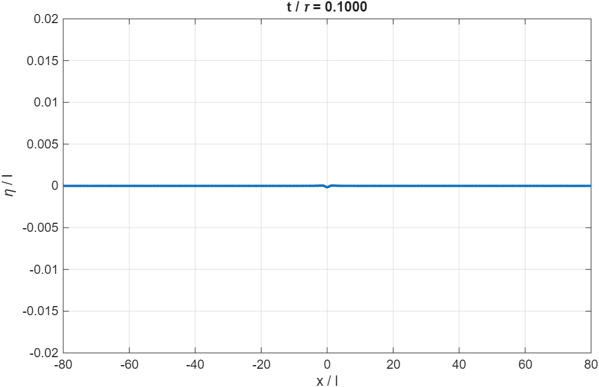

Python:

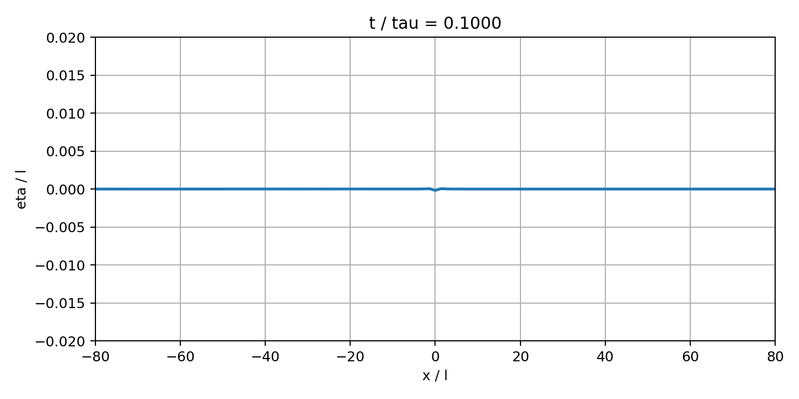

#### Snapshot at `t55`

MATLAB:

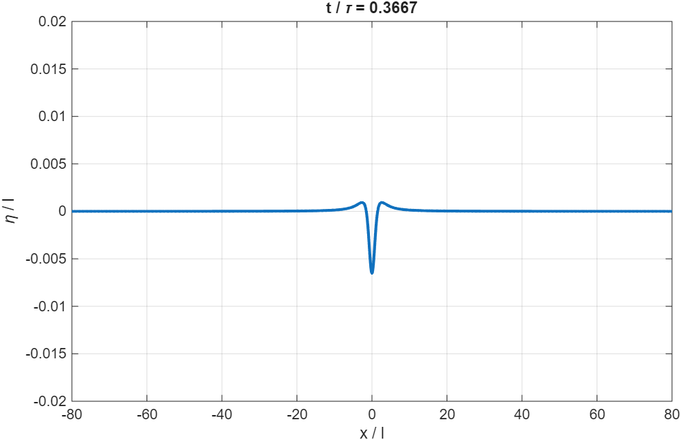

Python:

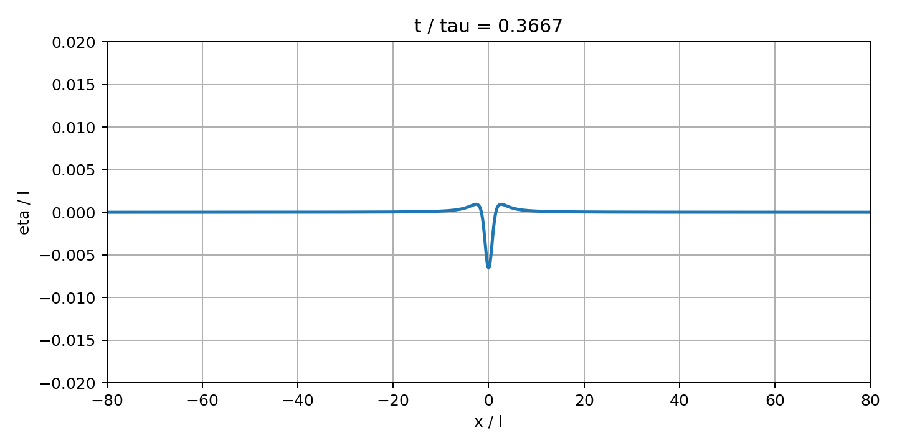

#### Snapshot at `t95`

MATLAB:

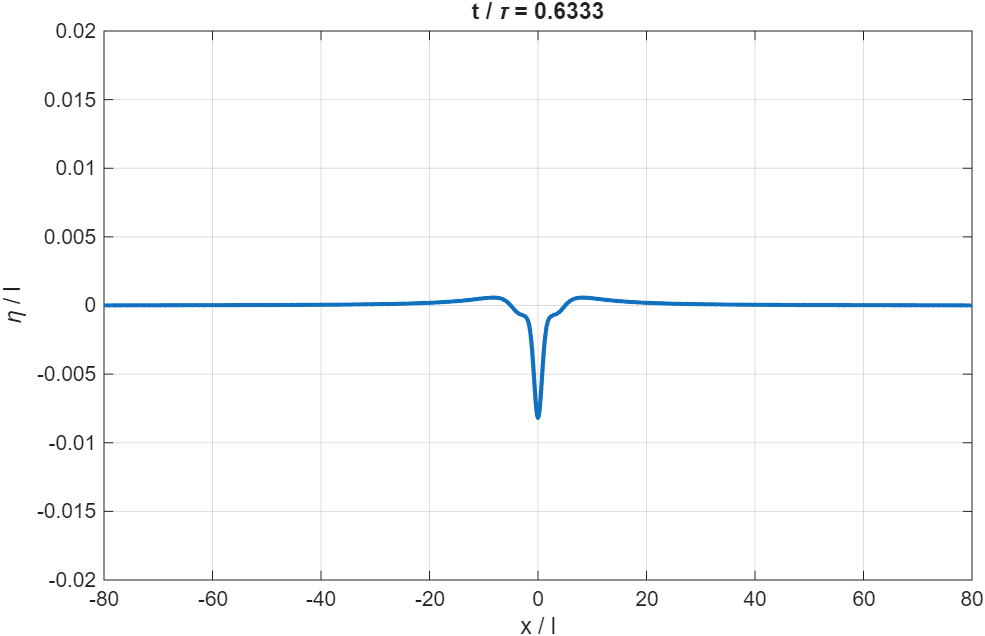

Python:

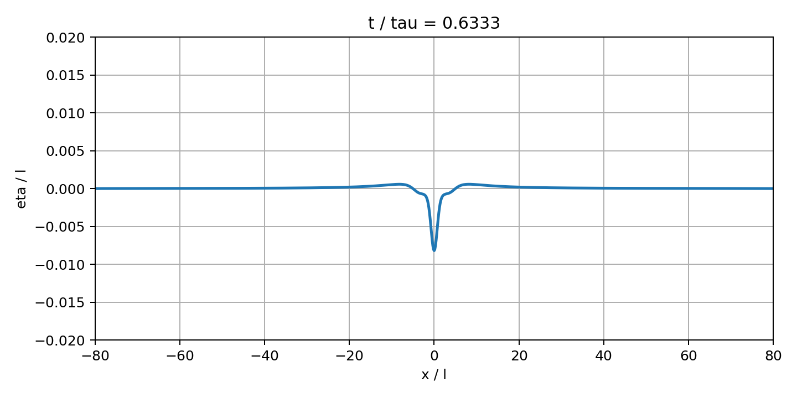

#### Snapshot at `t135`

MATLAB:

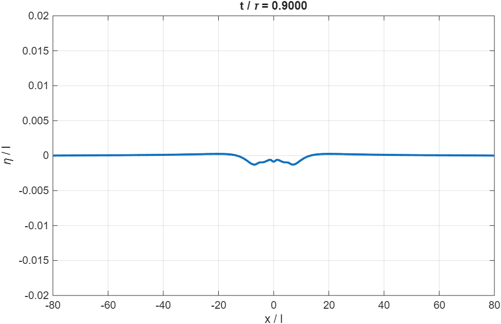

Python:

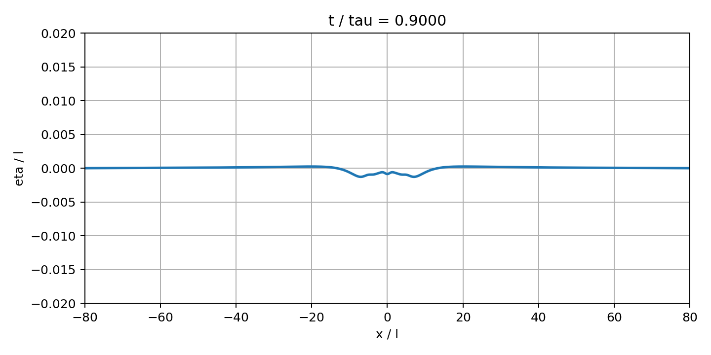

Taken together, these four time levels are the clearest evidence that the Python solver is reproducing the same qualitative free-surface evolution as the original MATLAB code.

## Source Notes

- [`src/dtn.py`](./src/dtn.py) contains the main DtN matrix construction and an inline script that reproduces the paper-style validation figures.
- [`src/spectral.py`](./src/spectral.py) provides the FFT-based DtN operator for periodic data.
- [`src/simulation.py`](./src/simulation.py) implements the time-dependent free-surface model using the same nondimensional groups and forcing structure as the MATLAB reconstruction.
- [`original/DtNmatrix.m`](./original/DtNmatrix.m) and [`original/simulation.m`](./original/simulation.m) preserve the MATLAB reference implementation used for comparison.

## Current Outputs In `results/figures`

Saved figures currently include:

- MATLAB DtN validation and matrix-structure plots
- MATLAB simulation pressure surface and time snapshots
- Python DtN validation, matrix-structure, convergence, and sinusoidal-test plots
- Python simulation pressure surface and time snapshots

If you rerun the experiment scripts, the figures in `results/figures` will be updated.
