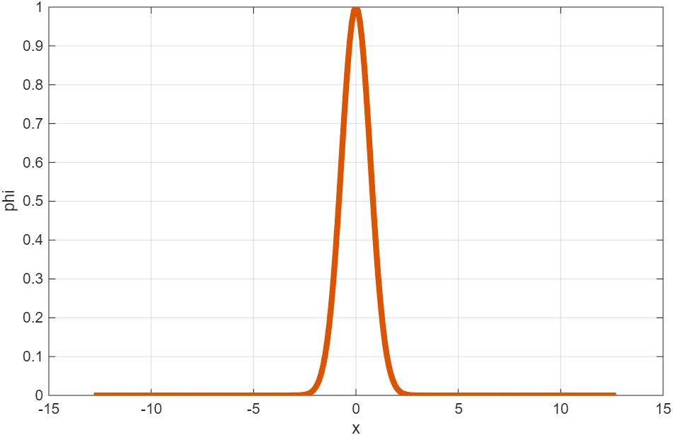

# Replication Report: Python vs Original MATLAB

## Scope

This report documents the important comparisons between the replicated Python implementation and the original MATLAB code preserved in `original/`. It focuses on:

- the Dirichlet-to-Neumann (DtN) operator construction,
- the FFT/spectral reference method,
- the time-dependent free-surface simulation,
- the validation and test strategy,
- the generated figures that support the replication claims.

The main source pairs are:

| Original MATLAB | Python replication | Purpose |
|---|---|---|
| `original/DtNmatrix.m` | `src/dtn.py` | DtN matrix construction and Gaussian validation |
| `original/simulation.m` | `src/simulation.py` | Crank-Nicholson free-surface simulation |
| inline FFT block in `original/DtNmatrix.m` | `src/spectral.py` and `src/dtn.py:dtn_spectral` | Spectral DtN reference |

## Executive Summary

The Python code reproduces the original MATLAB workflow at the method level:

- the same DtN weight template is assembled and mirrored into a dense Toeplitz-like matrix,
- the same FFT-based spectral DtN reference is used for Gaussian validation,
- the same nondimensional groups, Gaussian pressure loading, and Crank-Nicholson block system are used in the free-surface simulation,
- the same key output types are generated: pressure surface and selected free-surface snapshots.

The main differences are organizational rather than mathematical:

- Python separates logic into reusable functions instead of a single script style,
- `src/spectral.py` is factored out as a reusable module,
- `experiments/convergence_test.py` extends the paper-style validation with additional checks that are not part of the original appendix listing,
- the Python 3D pressure plot required rendering adjustments to better match MATLAB's smoother `surf` output.

## 1. DtN Matrix Construction

### What the original MATLAB code does

`original/DtNmatrix.m` constructs a template vector `line` and then mirrors/shifts it into a dense matrix `N`.

Key steps:

- special near-singularity weights are assigned directly:
  - `line(1) = 1 + 11/3`
  - `line(2) = -16/9`
  - `line(3) = -1/18`
- far-field contributions are accumulated in the loop over odd `nn`
- the full vector is normalized by `1 / (pi * dx)`
- each row of `N` is built as a shifted reflected copy of the same template

Relevant source:

- [`original/DtNmatrix.m`](/d:/Test/cylinderimpact_replication/original/DtNmatrix.m#L17)
- [`original/DtNmatrix.m`](/d:/Test/cylinderimpact_replication/original/DtNmatrix.m#L74)

### What the Python code does

`src/dtn.py` reproduces the same logic in a function-based form:

- `build_line(m, dx)` computes the template vector
- `build_dtn_matrix(m, dx)` assembles the full matrix from that template

Relevant source:

- [`src/dtn.py`](/d:/Test/cylinderimpact_replication/src/dtn.py#L86)
- [`src/dtn.py`](/d:/Test/cylinderimpact_replication/src/dtn.py#L199)

### Replication

The Python code preserves the same mathematical decomposition:

- singular/near-field part,
- far-field accumulation,
- global normalization,
- translation-invariant matrix assembly.

The original MATLAB script is procedural; the Python version is modularized, but the numerical object being built is the same.

### Supporting images: Gaussian input and DtN validation

The Gaussian input and the matrix-vs-spectral comparison are the core DtN validation outputs. The MATLAB and Python implementations now both generate these figures.

#### MATLAB Gaussian input

#### Python Gaussian input

#### MATLAB DtN comparison

#### Python DtN comparison

### Supporting images: matrix structure

The original MATLAB script plots selected rows of `N`, and the Python experiment script does the same. These figures support the claim that the operator is assembled as shifted copies of a common weight pattern.

#### MATLAB DtN matrix structure

#### Python DtN matrix rows

## 2. Spectral / FFT Reference Method

### Original MATLAB formulation

The MATLAB code computes the spectral reference by:

1. dropping the repeated endpoint,
2. building the FFT wavenumber vector,
3. applying
   \[
   \widehat{\phi_z}(k) = |k| \hat{\phi}(k),
   \]
4. transforming back with `ifft`.

Relevant source:

- [`original/DtNmatrix.m`](/d:/Test/cylinderimpact_replication/original/DtNmatrix.m#L116)

### Python formulation

The same method appears in two places:

- `src/dtn.py:dtn_spectral`
- `src/spectral.py:spectral_dtn`

Relevant source:

- [`src/dtn.py`](/d:/Test/cylinderimpact_replication/src/dtn.py#L257)
- [`src/spectral.py`](/d:/Test/cylinderimpact_replication/src/spectral.py#L56)

### Replication judgment

Mathematically, this is the same spectral method as the MATLAB block. The Python version makes the same assumptions:

- periodic FFT grid,
- no repeated endpoint,
- multiplication by `|k|` in Fourier space,
- real part taken after inverse FFT to remove numerical noise.

### Method justification

The spectral method is used here as a benchmark, not the main operator representation. That matches the paper's logic:

- the DtN matrix is the real-space discretization actually used in the finite-grid framework,
- the spectral method gives a high-accuracy reference for smooth test data,
- comparing the two validates the matrix construction.

### Extended Python validation outputs

The Python repo also generates validation figures beyond the original appendix-style MATLAB scripts:

#### Python Gaussian convergence study

This supports the claim that the DtN matrix error decreases with grid refinement.

#### Python sinusoidal exact test

This is an additional repo-level verification step. It is not part of the original MATLAB appendix listing, but it is a strong complementary check because the DtN action on a pure Fourier mode is known exactly.

## 3. Free-Surface Simulation

### Original MATLAB simulation

`original/simulation.m`:

- sets the same physical and nondimensional parameters,
- builds the same DtN operator,
- constructs the centered second-difference matrix `DXX`,
- forms the Crank-Nicholson block matrices `A` and `B`,
- uses the same Gaussian pressure forcing,
- solves the coupled system step by step and exports snapshots.

Relevant source:

- [`original/simulation.m`](/d:/Test/cylinderimpact_replication/original/simulation.m#L10)
- [`original/simulation.m`](/d:/Test/cylinderimpact_replication/original/simulation.m#L72)
- [`original/simulation.m`](/d:/Test/cylinderimpact_replication/original/simulation.m#L83)
- [`original/simulation.m`](/d:/Test/cylinderimpact_replication/original/simulation.m#L119)

### Python simulation

`src/simulation.py` mirrors the same structure:

- `SimulationParameters` stores the same defaults,
- `gaussian_pressure` reproduces the same forcing law,
- `crank_nicholson_blocks` builds the same block matrices,
- `run_simulation` advances the coupled state,
- `save_outputs` exports the pressure surface and the four snapshots.

Relevant source:

- [`src/simulation.py`](/d:/Test/cylinderimpact_replication/src/simulation.py#L29)
- [`src/simulation.py`](/d:/Test/cylinderimpact_replication/src/simulation.py#L79)
- [`src/simulation.py`](/d:/Test/cylinderimpact_replication/src/simulation.py#L90)
- [`src/simulation.py`](/d:/Test/cylinderimpact_replication/src/simulation.py#L118)
- [`src/simulation.py`](/d:/Test/cylinderimpact_replication/src/simulation.py#L164)

### Replication judgment

This is a method-level replication rather than a literal line-by-line transcription. The Python code keeps the same numerical model:

- same domain size and grid counts,
- same `Fr` and `We`,
- same pressure loading,
- same Crank-Nicholson block structure,
- same snapshot indices `15, 55, 95, 135`.

The main change is software structure: Python separates grid generation, forcing, solver, and plotting into named functions.

## 4. Pressure Surface Comparison

The Gaussian pressure forcing is the same in both codes:

\[
p_s(x,t) = e^{-x^2} \left(\tfrac12 - \tfrac12 \cos(2\pi t)\right).
\]

Relevant source:

- [`original/simulation.m`](/d:/Test/cylinderimpact_replication/original/simulation.m#L83)
- [`src/simulation.py`](/d:/Test/cylinderimpact_replication/src/simulation.py#L79)

### Original MATLAB rendering

### Python rendering

### Comparison note

The underlying pressure field is the same. The main visible differences came from rendering rather than numerics:

- MATLAB `surf(..., 'LineStyle','none', 'FaceColor','interp')` produces a very smooth appearance,
- Matplotlib's default 3D surface plotting tended to downsample dense grids and show striping,
- the Python plot was adjusted to use full-resolution surface rendering and a closer view angle.

So this figure is useful mainly as a check of forcing consistency, not as a high-precision numeric validation by itself.

## 5. Free-Surface Snapshot Comparison

Both codes export snapshots at the same time-step indices. These are important because they show whether the replicated solver produces the same qualitative free-surface response.

### Snapshot at step 15

### Snapshot at step 55

### Snapshot at step 95

### Snapshot at step 135

### Comparison note

These snapshots are the most direct simulation-level comparison between original and replicated code. The important things to compare are:

- symmetry about the centerline,
- sign and shape of the main deformation,
- relative amplitude over time,
- persistence and damping behavior across the selected time levels.

The Python replication follows the same solver structure and exports the same diagnostic times, so these figures are the best visual evidence that the time integrator and forcing pipeline have been carried over correctly.

## 6. Validation and Test Strategy

### What comes directly from the original MATLAB appendix style

The original MATLAB scripts directly support:

- Gaussian DtN validation against a spectral reference,
- structural visualization of the DtN matrix,
- free-surface simulation under Gaussian pressure forcing,
- selected free-surface snapshots.

### What the Python repo adds

The Python repo adds formalized experiment scripts:

- [`experiments/gaussian_test.py`](/d:/Test/cylinderimpact_replication/experiments/gaussian_test.py): paper-style Gaussian DtN validation
- [`experiments/convergence_test.py`](/d:/Test/cylinderimpact_replication/experiments/convergence_test.py): extended verification

Important distinction:

- the Gaussian refinement part in `convergence_test.py` is intended to reproduce the spirit of Table 4.1,
- the sinusoidal exact test and structural checks are additional repo-level validation, not part of the original appendix listing.

### Test justification

The added tests are justified because they check complementary failure modes:

- Gaussian spectral comparison checks consistency with the paper-style benchmark,
- sinusoidal exact validation checks the DtN action on a Fourier mode with known exact answer,
- symmetry / row-sum / PSD checks probe structural properties expected from the operator itself.

This makes the Python repo stronger as a verification artifact than the appendix-style scripts alone.

## 7. Important Similarities and Differences

### Similarities

- Same DtN matrix construction logic.
- Same Gaussian validation setup for the core operator.
- Same nondimensional simulation parameters.
- Same block Crank-Nicholson system.
- Same Gaussian pressure forcing.
- Same snapshot schedule.

### Differences

- Python is modular; MATLAB is script-oriented.
- Python duplicates the spectral helper in both `src/dtn.py` and `src/spectral.py` for reuse.
- Python adds extra validation scripts and diagnostics beyond the appendix-style reconstruction.
- Python needed a plotting adjustment to make the pressure surface visually closer to MATLAB.

## 8. Limitations of the Current Verification State

This report is based on:

- checked source-code correspondence between MATLAB and Python,
- the generated figures currently present in `results/figures`,
- the documented intent of the experiment scripts.

The strongest comparisons in this report are visual and structural. A stricter replication audit would also record numerical error values side by side in the report itself, for example:

- mean Gaussian DtN error,
- convergence rates,
- exact sinusoidal max/mean error,
- MATLAB-vs-Python differences at the exported simulation snapshots.

## Conclusion

The Python code is a credible replication of the original MATLAB implementation at the numerical-method level. The strongest evidence is:

- close source-to-source correspondence in DtN construction,
- the same spectral benchmark logic,
- the same Crank-Nicholson block simulation structure,
- matching classes of generated outputs,
- additional Python-side tests that strengthen verification beyond the original appendix reconstruction.

The most important visual evidence in the repo is:

- the MATLAB DtN comparison figure for operator validation,
- the MATLAB/Python pressure surfaces for forcing consistency,
- the MATLAB/Python time snapshots for free-surface response comparison.
